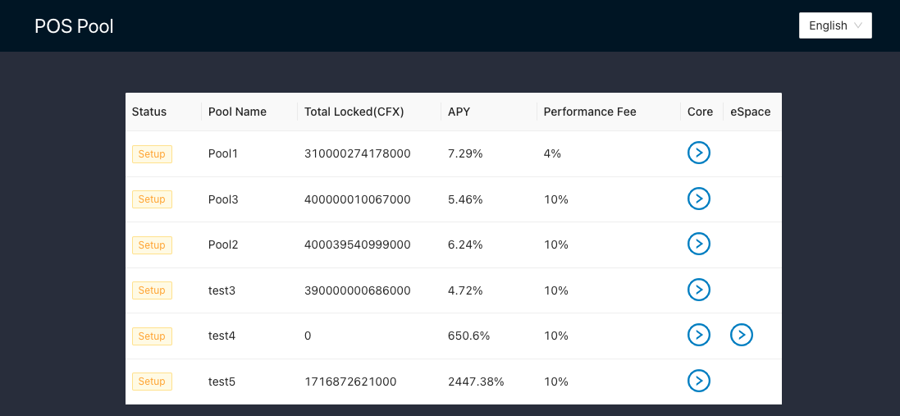

# Conflux PoS-Pool

**POS-POOL IS A OPEN SOURCED SOFTWARE. USE AT YOUR OWN RISK! WE ASSUME NO RESPONSIBILITY OR LIABILITY IF THERE IS A BUG IN THIS IMPLEMENTATION.**

This is the source code of **Conflux PoS pool dApp**, including Solidity and UI code. Anyone can use this code to set up a Conflux PoS pool to enable CFX holders to participate in Conflux PoS to earn staking rewards without running a Conflux node. The pool runner can share some CFX from PoS rewards as node maintenance costs.

This dApp is already deployed on Conflux Core Space testnet. You can try it out at [Testnet PoS-Pool](https://postest.confluxnetwork.org)

You can learn more about Conflux PoS at [it's documentation](https://doc.confluxnetwork.org/docs/general/conflux-basics/consensus-mechanisms/proof-of-stake/pos_overview)

## Prerequisite

To deploy PoS pool [**running a Conflux archive/full node**](https://doc.confluxnetwork.org/docs/category/run-a-node) is required

## Setup 

To set up a PoS pool you need to deploy the PoS pool contract and set up the UI.

To build and deploy the PoS pool contract check this [guide](./contract/README.md).

To set up the UI check this [guide](./interface/README.md)

## Disclaimer

It's PoS pool runner's responsibility to keep the PoS pool node running correctly. Here is the [Conflux PoS node running notice](https://forum.conflux.fun/t/guideline-for-the-usage-of-conflux-governance-beta-conflux-v2-0-0-testnet/12591)

## Conflux Mainnet PoS Pool List

There is a pool validator list for **Conflux Mainnet** at [Conflux PoS Validators List](https://www.conflux-pos-validators.com/)